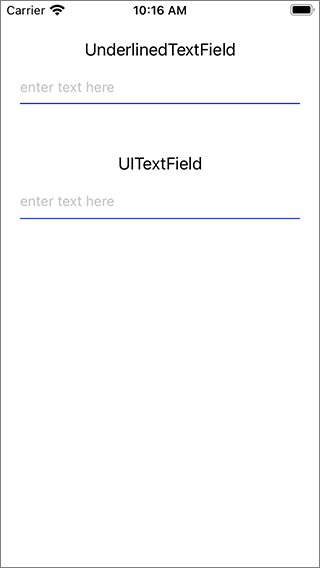

## UnderlinedTextField

This project demonstrates a couple of different ways to add an underline under a UITextField:

1. A custom subclass of `UITextField`, `UnderlinedTextField`. The `UnderlinedTextField` adds a on-point tall `CALayer` to the text field's layer. the `UnderlinedTextField` implements the `layoutSubviews()` method to update the underline layer's frame if the text field's frame changes.
2. A normal UITextField with a one-point UIView placed at the bottom, with a background color set to the desired underline color. The storyboard for the text field has auto layout constraints that pin the underline view to the leading, trailing, and bottom edges of the text view, and set it's height to 1 point.

Here is what the app's screen looks like:

